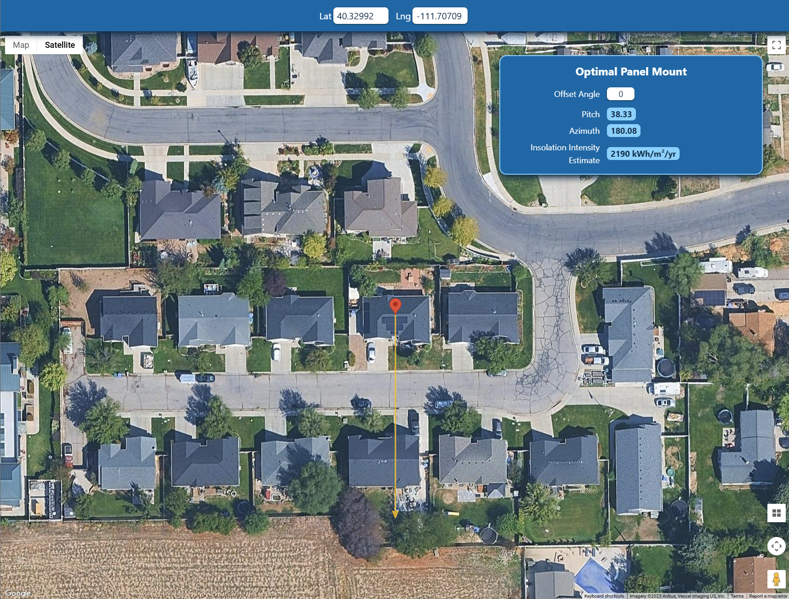

# 🌞 Solar Technical Assessment



## Setup

1. Run the following commands to clone the repository, copy the environment variable files, and start the application using Docker Compose:

```bash
git clone https://github.com/chevcast/solar-technical-assessment.git
cp ./frontend/.env.example ./frontend/.env # provide a Google Maps API key
cp ./backend/.env.example ./backend/.env # provide a Django secret key and NREL API key.
docker compose up
```

2. Navigate to `http://localhost:3000` in your browser.

## Architecture

### Frontend

- [SvelteKit](https://svelte.dev/)
- [TypeScript](https://www.typescriptlang.org/)
- [Tailwind CSS](https://tailwindcss.com/)
- [HTTP Proxy](https://github.com/http-party/node-http-proxy) to Django backend
- [Google Map](https://developers.google.com/maps) for location selection and visualization

### Backend

- [Django](https://www.djangoproject.com/) Web Framework
- [pvlib](https://pvlib-python.readthedocs.io/) Python Library for solar calculations

### pvlib vs solpy

I chose to use `pvlib` because it is actively developed and provides a wide selection of models for total irradiance calculation.

`solpy` is more lightweight and their documentation is very educational, but it also has not been actively maintained for a decade whereas pvlib is constantly incorporating new methods and models into its toolkit.

### Infrastructure

- [Docker](https://www.docker.com/) for containerization
- [Kubernetes](https://kubernetes.io/) for container orchestration
- [Helm Charts](https://helm.sh/) for deployment and management of applications
- [ArgoCD](https://argo-cd.readthedocs.io/) for GitOps continuous deployment

## Assumptions & Known Limitations

- Flat-plate, fixed-tilt array. No tracking optimzation.
- Horizon = 0deg. Terrain & shading obstacles not accounted for.
- Clearsky irradiance only. No weather data is used to account for clouds or other atmospheric conditions.
- Offset angle is interpreted as *existing roof pitch* and we simply subtract it from the calculated optimatl tilt.
- Browser geolocation only works on `localhost`. Any other origin domain will require a valid SSL certificate.
- Does not simulate PV system performance. It only calculates the optimal tilt and azimuth angles for a fixed-tilt solar array.
- No caching is implemented. The backend will recompute the optimal angles every time the user selects a new location or offset angle. Adding Redis caching would be a good next step to improve performance.
- K8s and Helm Charts are provided for deployment, but have not been tested in a production environment. They are intended to serve as a starting point for deployment.

## Modeling Logic

1. Create a full-year sunshine timetable. ([source](https://github.com/chevcast/solar-technical-assessment/blob/main/backend/webserver/views.py#L22-L30))

   - Build a pandas time series that covers every hour of the current calendar year in UTC.
   - For each timestamp we compute the extra-terrestrial DNI (soalr energy present just outside the atmosphere)

2. Describe the location. ([source](https://github.com/chevcast/solar-technical-assessment/blob/main/backend/webserver/views.py#L32-L41))

   - Generate zenith and azimuth angles for the location at each timestamp. (where the sun *is*)
   - Get the expected irradiance on a clear day, split into:
      - Direct Normal Irradiance (direct beam)
      - Diffuse Horizontal Irradiance (scattered light)
      - Global Horizontal Irradiance (total light on a horizontal surface)

3. Search for the optimal fixed tilt. ([source](https://github.com/chevcast/solar-technical-assessment/blob/main/backend/webserver/views.py#L43-L63))

   - The code sweeps surface tilts from latitude +/- 15 degrees in 1-degree steps.
   - For every candidate tilt we use the **Hay-Davies sky model** to convert dni/dhi/ghi values into **plane-of-array global irradiance** (the energy that would hit a surface tilted at the candidate angle).
   - Hourly POA is summed over the entire year and the tilt that yields the highest total is selected as the optimal tilt.

4. Apply offset angle. ([source](https://github.com/chevcast/solar-technical-assessment/blob/main/backend/webserver/views.py#L65-L66))

   If the roof is already pitched the user may provide that pitch as an offset angle that will be subtracted so that installers know the extra tilt they need to add with racking. This value is clamped between 0 and 90 degrees.

5. Determine the optimal azimuth. ([source](https://github.com/chevcast/solar-technical-assessment/blob/main/backend/webserver/views.py#L68-L79))

   - We build a 1-minute time grid around the spring equinox.
   - We then find the minute when the sun's zenith is at its lowest point (highest elevation) and use that as the optimal azimuth.
   - We use the azimuth at that moment to avoid seasonal bias since the sun is directly above the equator.
